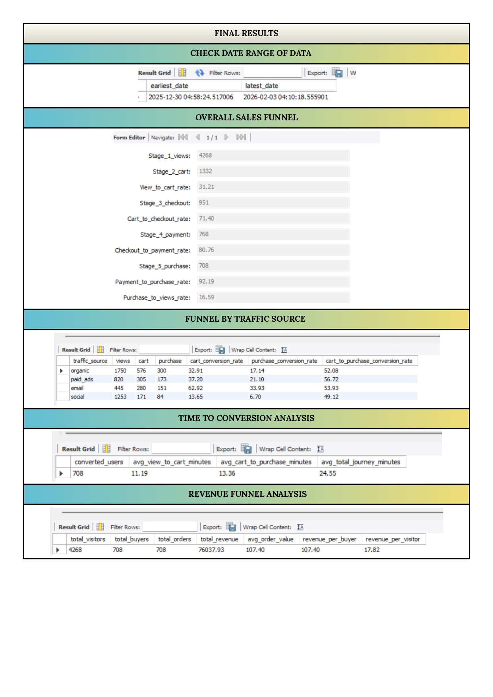

# 🛒 E-Commerce Sales Funnel Analysis Using MySQL

## 📌 Project Overview

This project analyzes an e-commerce customer journey using MySQL to understand how users move through different stages of the sales funnel. The analysis covers page views, add-to-cart actions, checkout, payment information, and purchases to identify customer drop-offs, conversion performance, customer journey time, and revenue generation.

---

## 🎯 Objectives

- Analyze the complete e-commerce sales funnel.
- Calculate conversion rates between different funnel stages.
- Identify customer drop-off points.
- Compare conversion performance across traffic sources.
- Analyze the time taken by users to complete a purchase.
- Calculate important revenue and sales metrics.
- Evaluate overall customer conversion and revenue performance.

---

## 📊 Sales Funnel

The customer journey is analyzed through five major stages:

Page View
↓
Add to Cart
↓
Checkout
↓
Payment Information
↓
Purchase

---

## 🗂️ Dataset

The project uses a `user_events` dataset containing customer interaction events.

### Dataset Columns

| Column | Description |
|---|---|
| `user_id` | Unique identifier of the customer |
| `event_type` | Type of customer interaction |
| `event_date` | Date and time of the event |
| `traffic_source` | Source through which the customer arrived |
| `amount` | Purchase amount |

### Event Types

- `page_view`
- `add_to_cart`
- `checkout_start`
- `payment_info`
- `purchase`

---

## 🛠️ Technologies Used

- MySQL
- SQL
- MySQL Workbench

---

## 🔍 Analysis Performed

### 1. Overall Sales Funnel Analysis

Calculated the number of unique users at each stage:

- Page Views
- Add to Cart
- Checkout
- Payment Information
- Purchases

Calculated conversion rates between each stage.

### 2. Funnel by Traffic Source

Compared customer conversion across different traffic sources using:

- Cart Conversion Rate
- Purchase Conversion Rate
- Cart-to-Purchase Conversion Rate

### 3. Time-to-Conversion Analysis

Calculated the average time taken by customers for:

- View → Add to Cart
- Add to Cart → Purchase
- View → Purchase

### 4. Revenue Funnel Analysis

Calculated:

- Total Visitors
- Total Buyers
- Total Orders
- Total Revenue
- Average Order Value
- Revenue per Buyer
- Revenue per Visitor

---

## 📈 Final Results

### Overall Sales Funnel

| Funnel Stage | Users |
|---|---:|
| Page Views | 4,268 |
| Add to Cart | 1,332 |
| Checkout | 951 |
| Payment Information | 768 |
| Purchase | 708 |

### Conversion Rates

| Conversion Stage | Rate |
|---|---:|
| View → Cart | 31.21% |
| Cart → Checkout | 71.40% |
| Checkout → Payment | 80.76% |
| Payment → Purchase | 92.19% |
| Purchase → Views | 16.59% |

---

## 📊 Traffic Source Analysis

| Traffic Source | Views | Cart | Purchase | Cart Conversion Rate | Purchase Conversion Rate | Cart-to-Purchase Rate |
|---|---:|---:|---:|---:|---:|---:|
| Organic | 1,750 | 576 | 300 | 32.91% | 17.14% | 52.08% |
| Paid Ads | 820 | 305 | 173 | 37.20% | 21.10% | 56.72% |
| Email | 445 | 280 | 151 | 62.92% | 33.93% | 53.93% |
| Social | 1,253 | 171 | 84 | 13.65% | 6.70% | 49.12% |

---

## ⏱️ Time-to-Conversion Analysis

| Metric | Result |
|---|---:|
| Converted Users | 708 |
| Average View → Cart | 11.19 minutes |
| Average Cart → Purchase | 13.36 minutes |
| Average Total Journey | 24.55 minutes |

---

## 💰 Revenue Analysis

| Metric | Result |
|---|---:|
| Total Visitors | 4,268 |
| Total Buyers | 708 |
| Total Orders | 708 |
| Total Revenue | 76,037.93 |
| Average Order Value | 107.40 |
| Revenue per Buyer | 107.40 |
| Revenue per Visitor | 17.82 |

---

## 💡 Key Insights

- The funnel received 4,268 unique visitors and generated 708 purchases.
- The overall visitor-to-purchase conversion rate was 16.59%.
- The largest drop-off occurred between Page View and Add to Cart, with a conversion rate of 31.21%.
- Email traffic had the highest cart conversion rate at 62.92%.
- Email traffic had the highest purchase conversion rate at 33.93%.
- Social traffic had the lowest purchase conversion rate at 6.70%.
- The average time from page view to add-to-cart was 11.19 minutes.
- The average total customer journey was 24.55 minutes.
- Total revenue generated was 76,037.93.
- The average order value was 107.40.

---

## 🧠 SQL Concepts Used

- Common Table Expressions (CTEs)
- SELECT
- WHERE
- GROUP BY
- ORDER BY
- CASE WHEN
- COUNT()
- COUNT(DISTINCT)
- SUM()
- AVG()
- MIN()
- ROUND()
- STR_TO_DATE()
- TIMESTAMPDIFF()
- NULLIF()
- Date filtering
- Conditional aggregation
- Conversion rate calculations
- Revenue calculations

---

## 📐 Key Formulas

### View-to-Cart Conversion Rate

Add to Cart Users / Page View Users × 100

### Cart-to-Checkout Conversion Rate

Checkout Users / Cart Users × 100

### Checkout-to-Payment Conversion Rate

Payment Users / Checkout Users × 100

### Payment-to-Purchase Conversion Rate

Purchase Users / Payment Users × 100

### Purchase-to-View Conversion Rate

Purchase Users / Page View Users × 100

### Average Order Value

Total Revenue / Total Orders

### Revenue per Buyer

Total Revenue / Total Buyers

### Revenue per Visitor

Total Revenue / Total Visitors

---

## 📷 Project Results

The complete SQL analysis results are shown in the project results image:



---

## 📁 Project Structure

E-Commerce-Sales-Funnel-Analysis/
│
├── README.md
│
├── ecommerce_sales_funnel.sql
│
├── user_events.csv
│
└── image.jpg

---

## 🚀 How to Run the Project

### 1. Clone the Repository

```bash
git clone <your-repository-url>
